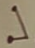

# Code

## Characters

|                    |                    |                    |                    |                    |                    |                    |                    |                    |
| ------------------ | ------------------ | ------------------ | ------------------ | ------------------ | ------------------ | ------------------ | ------------------ | ------------------ |
|  |  |  |  |  |  |  |  |  |
| A                  | B                  | C                  | D                  | E                  | F                  | G                  | H                  | I                  |
| T                  | H                  | E                  | R                  | I                  | S                  | P                  | O                  | W                  |
|  |  |  |  |  |  |  |  |  |
| J                  | K                  | L                  | M                  | N                  | O                  | P                  | Q                  | R                  |
| Q                  | M                  | D                  | N                  | A                  | K                  | U                  | F                  | C                  |
|  |  |  |  |  |  |  |  |                    |
| S                  | T                  | U                  | V                  | W                  | X                  | Y                  | Z                  |                    |
| X                  | J                  | V                  | B                  | L                  | Y                  | G                  | Z                  |                    |

## Cypher Text

ABCDC EF GHICD BCDC
LCCG GCMCNAB ABC
FPCQNRC, N FHPDRC
CSEFAF. IC BNUC VPEWA
ABDCC DCFCNDRB
QNREWEAECF FH QND,
VPA EQ KX RHWWCNYPCF
YCA ABCED INI, IC IEWW
RHKC NINX IEAB ZCDH.

ABCX TPFA NDC MHA
NVWC AH FCC KX UEFEHM.
ABEF RHPWL RBNMYC
CUCDXABEMY, VPA FHKC
NDC JPERO AH QCND
IC MCCL LHPVWC ABC
DCFCNDRB

## Plain Text

THERE IS POWER HERE
DEEP BENEATH THE
SURFACE, A SOURCE
EXISTS. WE HAVE BUILT
THREE RESEARCH
FACILITIES SO FAR,
BUT IF MY COLLEAGUES
GET THEIR WAY, WE WILL
COME AWAY WITH ZERO.

THEY JUST ARE NOT
ABLE TO SEE MY VISION.
THIS COULD CHANGE
EVERYTHING, BUT SOME
ARE QUICK TO FEAR
WE NEED DOUBLE THE
RESEARCH
